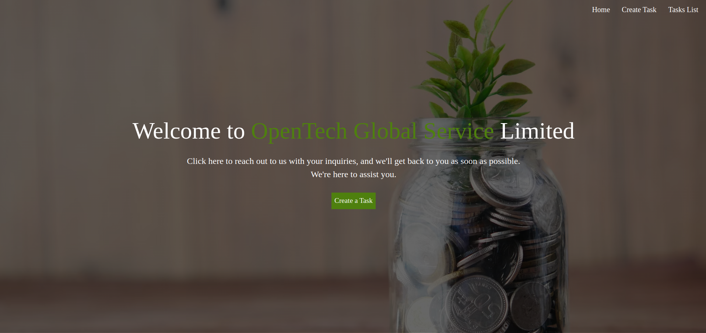
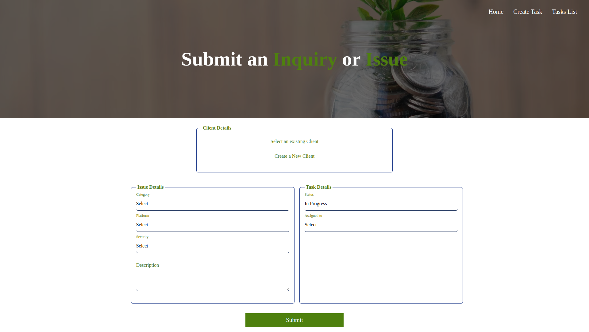
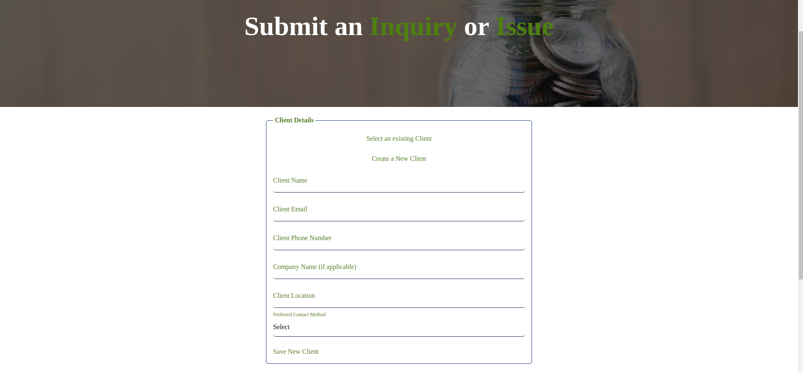
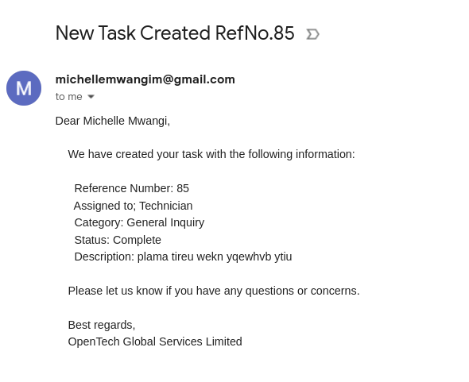
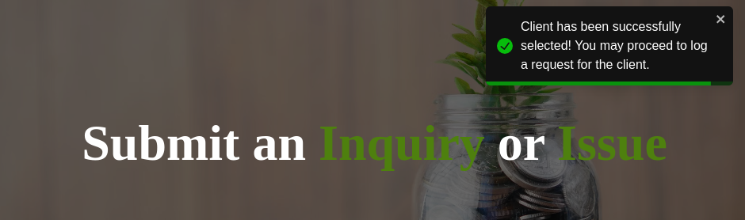
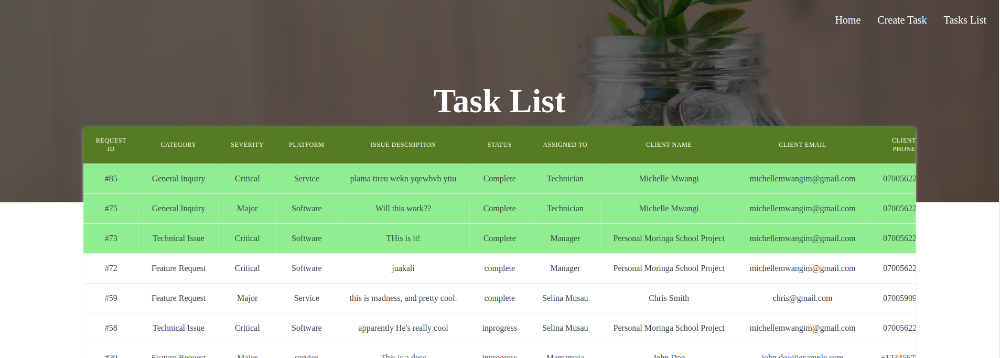
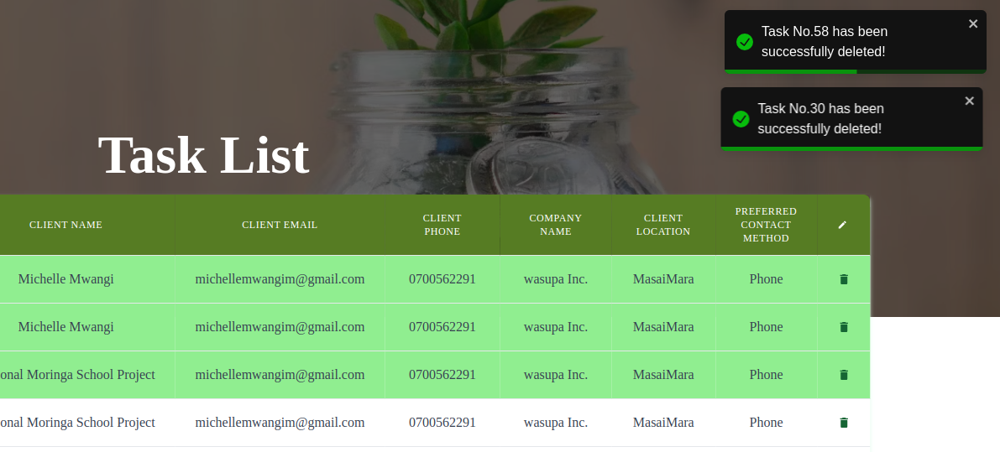

# Frontend Application

## Overview

This project is the frontend component of our web application, developed using [React](https://reactjs.org/) and [Tailwind CSS](https://tailwindcss.com/). It interacts with a backend API to provide a seamless user experience.

## Table of Contents

- [Frontend Application](#frontend-application)
  - [Overview](#overview)
  - [Table of Contents](#table-of-contents)
  - [Installation](#installation)
    - [Prerequisites](#prerequisites)
    - [Steps](#steps)
  - [Application Features](#application-features)
    - [Home Page](#home-page)
    - [Create Task Page](#create-task-page)
    - [Option to Create a new Client or to Select an existing one](#option-to-create-a-new-client-or-to-select-an-existing-one)
    - [Notification System](#notification-system)
    - [Task List View](#task-list-view)
  - [License](#license)

## Installation

### Prerequisites

Ensure you have the following installed:

- [Node.js](https://nodejs.org/) (v14 or later)
- [npm](https://www.npmjs.com/) (v6 or later) or [yarn](https://yarnpkg.com/) (v1.22 or later)

### Steps

1. Clone the repository:

   ```sh git clone https://github.com/yourusername/your-repo-name.git
   cd your-repo-name
   ```

2. Install the dependencies:

`npm install`

3. Run the app
   `npm run dev`

## Application Features

### Home Page

A landing page that provides seamless navigation through the app.


### Create Task Page

A page that provides a form to create a new Task with the following fields:


### Option to Create a new Client or to Select an existing one

Select an existing slient from the database


Create a New CLient and add them to the databse


### Notification System

Email Notifications to the Client once a task is successfully logged. The email does include a unique reference number.


Notifications to keep the user informaed and maintain a smooth experience


### Task List View

A view that allows the user to see historic records of tasks.
The tasks list is color coded depending on the Status


Tasks can also be deleted


## License

This project is licensed to @Michelle Mwangi under the MIT License.
